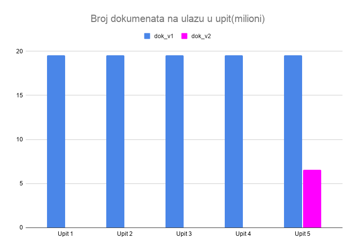
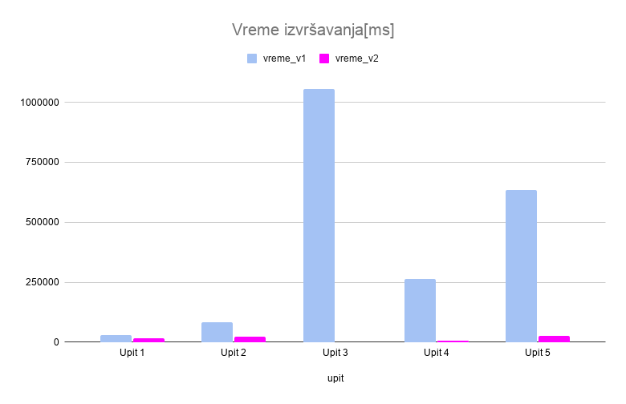

# SBP-Project

Projekat iz predmeta Sistemi baza podataka, Fakultet Tehničkih Nauka

Tema: Analitika igara i korisničkih dostignuća u PlayStation ekosistemu

Autor: Irina Radanović, IN 5/2022

---
# Skup podataka
[Skup podataka preuzet sa Kaggle platforme](https://www.kaggle.com/datasets/artyomkruglov/gaming-profiles-2025-steam-playstation-xbox)

Javno dostupni "Gaming Profiles 2025 (Steam, PlayStation, Xbox)" sa *Kaggle* platforme, autor Artyom Kruglov. 

Skup se sastoji od više datoteka u okviru playstation direktorijuma. Sadrži podatke o igrama, cenama, igračima i osvojenim trofejima između 2008. i 2025. godine

# Upiti iz perspektive biznis analitičara Playstation platforme

1. Kako se kroz godine menja prosečno vreme koje prođe od izlaska igre do trenutka kada prvi igrač na svetu osvoji neki trofej?
2. Koliki je procenat igrača koji su imali 100% completion rate za svaku igricu? (Top 20 igara)
3. Koji žanrovi igara privlače najveći prosečan broj igrača po pojedinačnoj igri, kolika je njihova prosečna cena u USD?
4. Iz kojih država dolaze najuspešniji igrači na platformi? Izdvojiti top 10 država sa najvećim ukupnim brojem osvojenih "Platinum" trofeja u 2024. godini.
5. Da li su igrači kroz godine(2021-2024) postali "lovci na trofeje"? Odnosno, da li se broj osvojenih teških trofeja povećava kako se platforma razvija?

# Šeme 
Kreirane su dve šeme baze podataka, cilj pri kreiranju druge šeme bio je poboljšanje performansi.

Prva šema se nalazi u okviru `initial-schema` direktorijuma. Druga, optimizovana(denormalizacija, agregacija, indeksi) se nalazi u okviru `optimized-schema` direktorijuma.

Oba direktorijuma imaju u sebi `scripts` folder sa skriptama za punjenje baze. Potom, `schema` folder sa opisom šeme. I `queries` sa prikazom upita i rezultatima performanse.

# Rezultati upita
Vizualizacija rezultata upita uz korišćenje alata *Metabase-u* `dashboard` direktorijumu

# Rezultat optimizacije
Procena performansi izvršena je pomoću metode explain("executionStats") koju nudi MongoDB. Mereno je vreme izvršavanja, kao i broj dokumenata na ulazu u upit.

