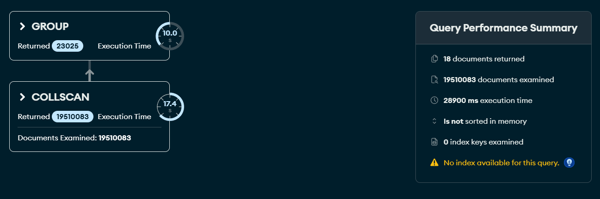
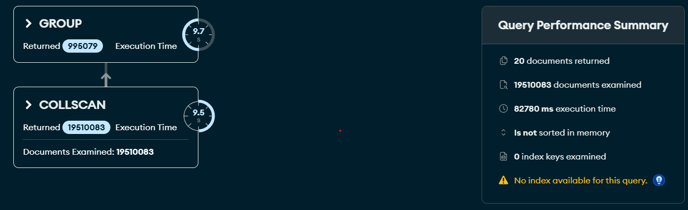
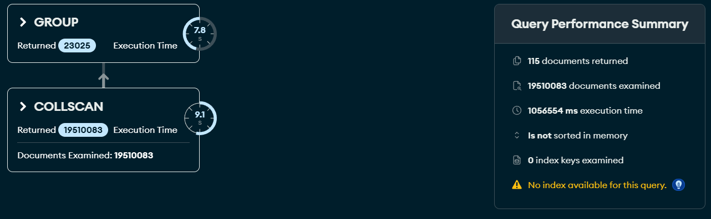
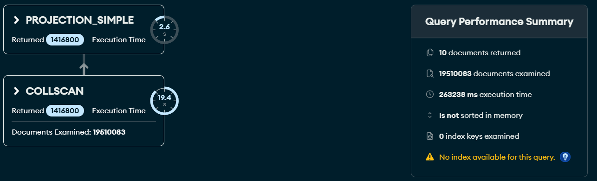
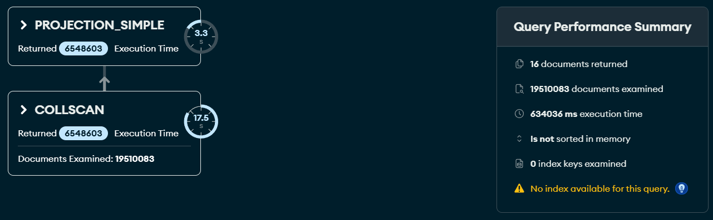

# Upiti

# 1. Kako se kroz godine menja prosečno vreme koje prođe od izlaska igre do trenutka kada prvi igrač na svetu osvoji neki trofej?

```javascript
db.player_history.aggregate([
  {
    $group: {
      _id: "$gameid",
      first_achievement_date: { $min: "$date_acquired" }
    }
  },
  {
    $lookup: {
      from: "games",
      localField: "_id",
      foreignField: "_id",
      as: "game_info"
    }
  },
  { $unwind: "$game_info" },
  {
    $project: {
      _id: 0,
      release_year: { $year: "$game_info.release_date" },
      days_to_first: {
        $divide: [
          { $subtract: ["$first_achievement_date", "$game_info.release_date"] },
          1000 * 60 * 60 * 24
        ]
      }
    }
  },
  { 
    $match: { 
      days_to_first: { $gte: 0 }, 
      release_year: { $ne: null } 
    } 
  },
  {
    $group: {
      _id: "$release_year",
      average_days: { $avg: "$days_to_first" }
    }
  },
  { $sort: { _id: 1 } }
])

```


Većina vremena odlazi na skeniranje i grupisanje po igrama, potrben indeks nad tom kolonom.

---

# 2. Koliki je procenat igrača koji su imali 100% completion rate za svaku igricu? (Top 20 igara)

```javascript
db.player_history.aggregate([
  {
    $group: {
      _id: { gameid: "$gameid", playerid: "$playerid" },
      player_earned_count: { $sum: 1 }
    }
  },
  {
    $lookup: {
      from: "games",
      localField: "_id.gameid",
      foreignField: "_id",
      as: "game_info"
    }
  },
  { $unwind: "$game_info" },
  {
    $project: {
      game_title: "$game_info.title",
      total_achievements: { $size: "$game_info.achievements" },
      player_earned_count: 1
    }
  },
  {
    $group: {
      _id: "$game_title",
      total_active_players: { $sum: 1 },
      completed_players: {
        $sum: {
          $cond: [{ $eq: ["$player_earned_count", "$total_achievements"] }, 1, 0]
        }
      }
    }
  },
  {
    $project: {
      _id: 0,
      game_title: "$_id",
      total_active_players: 1,
      completion_rate_percentage: {
        $multiply: [{ $divide: ["$completed_players", "$total_active_players"] }, 100]
      }
    }
  },
  { $sort: { total_active_players: -1 } }, 
  { $limit: 20 }
])
```


Najveći trošak(oko 60s) troši `$lookup` koji za milion pojedinačnih pretraga pretražuje naziv igre i trofeja.
Moguće rešenje je denormalizovana šema. Za grupisanje i skeniranje kompozitni indeks za gameid i playerid.

---

# 3. Koji žanrovi igara privlače najveći prosečan broj igrača po pojedinačnoj igri, kolika je njihova prosečna cena u USD?

```javascript
db.player_history.aggregate([
  {
    $group: {
      _id: "$gameid",
      broj_igraca: { $sum: 1 }
    }
  },

  {
    $lookup: {
      from: "prices",
      localField: "_id",
      foreignField: "gameid",
      as: "cena_info"
    }
  },
  { $unwind: "$cena_info" },

  {
    $lookup: {
      from: "games",
      localField: "_id",
      foreignField: "_id",
      as: "igra_info"
    }
  },
  { $unwind: "$igra_info" },

  {
    $match: {
      "igra_info.genres": { $exists: true, $ne: null, $not: { $size: 0 } },
      "cena_info.usd": { $exists: true, $ne: null }
    }
  },

  { $unwind: "$igra_info.genres" },

  {
    $group: {
      _id: "$igra_info.genres",
      prosecan_broj_igraca: { $avg: "$broj_igraca" },
      prosecna_cena_usd: { $avg: "$cena_info.usd" }
    }
  },

  { $sort: { prosecan_broj_igraca: -1 } },
  { $project: { genres: "$_id", 
                prosecan_broj_igraca: { $round: ["$prosecan_broj_igraca", 0] }, 
                prosecna_cena_usd: { $round: ["$prosecna_cena_usd", 2] } 
    }
])


```


Nakon prvog grupisanja, baza je dobila 23.025 jedinstvenih igara. Za svaku od tih igara, MongoDB je morao da ode u kolekciju prices i pretraži je (1. lookup) i da ode u kolekciju games i pretraži je (2. lookup).

---

# 4. Iz kojih država dolaze najuspešniji igrači na platformi? Izdvojiti top 10 država sa najvećim ukupnim brojem osvojenih "Platinum" trofeja u 2024. godini.

```javascript
db.player_history.aggregate([
  {
    $match: {
      "date_acquired": { 
        $gte: ISODate("2024-01-01T00:00:00Z"),
        $lt: ISODate("2025-01-01T00:00:00Z")
      }
    }
  },

  {
    $lookup: {
      from: "games",
      localField: "gameid",
      foreignField: "_id",
      as: "igra_info"
    }
  },
  { $unwind: "$igra_info" },

  { $unwind: "$igra_info.achievements" },

  {
    $match: {
      "igra_info.achievements.rarity": "Platinum"
    }
  },

  {
    $lookup: {
      from: "players",
      localField: "playerid",
      foreignField: "_id",
      as: "player_info"
    }
  },
  { $unwind: "$player_info" },

  {
    $group: {
      _id: "$player_info.country",
      ukupno_platinum_trofeja: { $sum: 1 }
    }
  },

  { $sort: { ukupno_platinum_trofeja: -1 } },
  { $limit: 10 },

  {
    $project: {
      _id: 0,
      drzava: "$_id",
      ukupno_platinum_trofeja: 1
    }
  }
])

```


Pošto polje `date_acquired` nema indeks, MongoDB je morao da podigne sa diska i pretraži svaki pojedinačni dokument od ukupno 19.5 miliona u kolekciji `player_history`. Potom je izdvojio 1.416.800 dokumenata koji pripadaju 2024. godini. Ovde je izgubljeno prvih 20 sekundi.
Oko 90% vremena: $lookup i $unwind faza bez indeksa nad 1.4 miliona dokumenata su doveli do sporog izvršavanja.
Dalji planČ indeksiranje i denormalizacija.

---

# 5. Da li su igrači kroz godine(2021-2024) postali "lovci na trofeje"? Odnosno, da li se broj osvojenih teških trofeja povećava kako se platforma razvija?

```javascript
db.player_history.aggregate([
  {
    $match: {
      "date_acquired": { 
        $gte: ISODate("2021-01-01T00:00:00Z"),
        $lt: ISODate("2025-01-01T00:00:00Z")
      }
    }
  },

  {
    $lookup: {
      from: "games",
      localField: "gameid",
      foreignField: "_id",
      as: "igra_info"
    }
  },
  { $unwind: "$igra_info" },
  { $unwind: "$igra_info.achievements" },

  {
    $group: {
      _id: {
        godina: { $year: "$date_acquired" },
        rarity: { $toLower: "$igra_info.achievements.rarity" }
      },
      ukupno_osvojeno: { $sum: 1 }
    }
  },

  {
    $project: {
      _id: 0,
      godina: "$_id.godina",
      rarity: "$_id.rarity",
      ukupno_osvojeno: 1
    }
  },
  { $sort: { ukupno_osvojeno: -1 } }
])

```


Glavno usko grlo (preko 95% vremena) ostaje operacija $lookup i $unwind