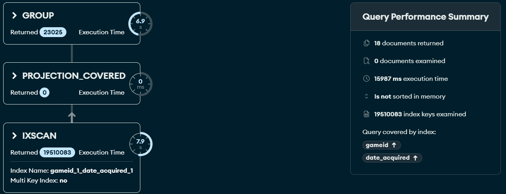
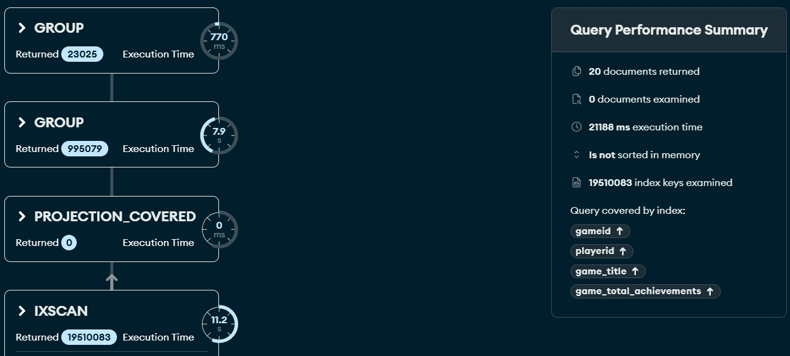
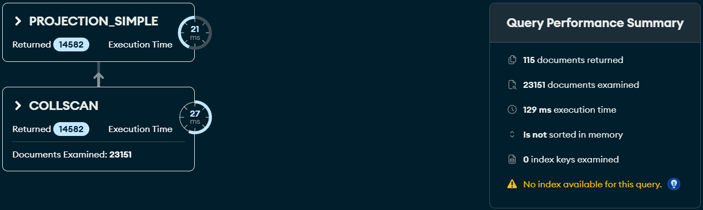
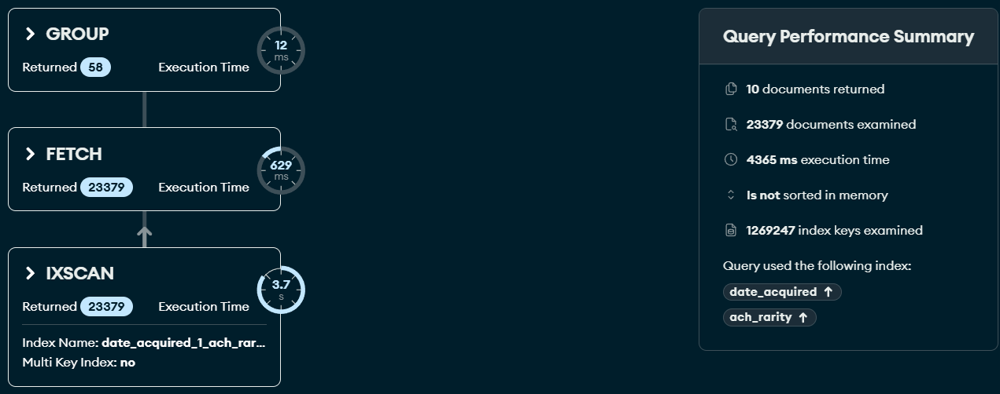
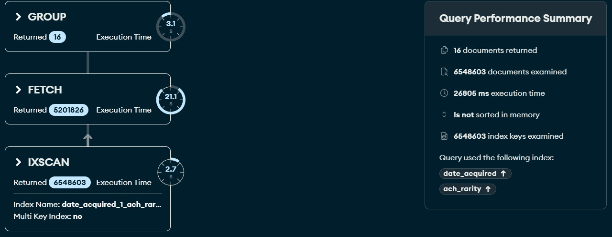

# Upiti-Optimizovana verzija

# 1. Kako se kroz godine menja prosečno vreme koje prođe od izlaska igre do trenutka kada prvi igrač na svetu osvoji neki trofej?-16s

```javascript
db.player_history_opt.aggregate([
  { $sort: { gameid: 1, date_acquired: 1 } },

  {
    $group: {
      _id: "$gameid",
      first_achievement_date: {
        $min: "$date_acquired"
      }
    }
  },

  {
    $lookup: {
      from: "games_opt",
      localField: "_id",
      foreignField: "_id",
      as: "igra_info"
    }
  },
  { $unwind: "$igra_info" },

  {
    $project: {
      _id: 0,
      release_year: {
        $year: "$igra_info.release_date"
      },
      days_to_first: {
        $divide: [
          {
            $subtract: [
              "$first_achievement_date",
              "$igra_info.release_date"
            ]
          },
          1000 * 60 * 60 * 24
        ]
      }
    }
  },
  {
    $match: {
      days_to_first: { $gte: 0 },
      release_year: { $ne: null }
    }
  },
  {
    $group: {
      _id: "$release_year",
      average_days: { $avg: "$days_to_first" }
    }
  },
  { $sort: { _id: 1 } },
  {
    "$project": {
      "_id": 0,
      "release_year": "$_id",
      "average_days": 1
    }
  }
])

```




---

# 2. Koliki je procenat igrača koji su imali 100% completion rate za svaku igricu? (Top 20 igara)-21s

```javascript
db.player_history_opt.aggregate([
  {
    $sort: { gameid: 1, playerid: 1 }
  },

  {
    $group: {
      _id: {
        gameid: "$gameid",
        playerid: "$playerid"
      },
      player_earned_count: { $sum: 1 },
      total_achievements: {
        $first: "$game_total_achievements"
      }
    }
  },
  {
    $group: {
      _id: "$_id.gameid",
      completed_players: {
        $sum: {
          $cond: [
            {
              $eq: [
                "$player_earned_count",
                "$total_achievements"
              ]
            },1,0
          ]
        }
      }
    }
  },
  {
    $lookup: {
      from: "games_opt",
      localField: "_id",
      foreignField: "_id",
      as: "igra_info"
    }
  },
  { $unwind: "$igra_info" },

  {
    $project: {
      _id: 0,
      game_title: "$igra_info.title",
      total_active_players:
        "$igra_info.total_num_of_players",
      completion_rate_percentage: {
        $round: [
          {
            $multiply: [
              {
                $divide: [
                  "$completed_players",
                  "$igra_info.total_num_of_players"
                ]
              },
              100
            ]
          },
          2
        ]
      }
    }
  },
  {
    $sort: {
      completion_rate_percentage: -1,
      total_active_players: -1
    }
  },
  { $limit: 20 }
])
```




---

# 3. Koji žanrovi igara privlače najveći prosečan broj igrača po pojedinačnoj igri, kolika je njihova prosečna cena u USD?-129ms

```javascript
db.games_opt.aggregate([
  { $unwind: "$genres" }, 
  {
    $match: {
      "genres": { $exists: true, $ne: null },
      "price_usd": { $exists: true, $ne: null },
      "total_num_of_players": { $exists: true } 
    }
  },
  
  {
    $group: {
      _id: "$genres",
      prosecan_broj_igraca: { $avg: "$total_num_of_players" },
      prosecna_cena_usd: { $avg: "$price_usd" }
    }
  },

  { $sort: { prosecan_broj_igraca: -1 } },
  {
    $project: {
      _id: 0,
      genres: "$_id",
      prosecan_broj_igraca: { $round: ["$prosecan_broj_igraca", 0] },
      prosecna_cena_usd: { $round: ["$prosecna_cena_usd", 2] }
    }
  }
])
```




---

# 4. Iz kojih država dolaze najuspešniji igrači na platformi? Izdvojiti top 10 država sa najvećim ukupnim brojem osvojenih "Platinum" trofeja u 2024. godini.-4.4s

```javascript
db.player_history_opt.aggregate([
  {
    $match: {
      date_acquired: {
        $gte: ISODate("2024-01-01T00:00:00Z"),
        $lt: ISODate("2025-01-01T00:00:00Z")
      },
      ach_rarity: "Platinum"
    }
  },
  {
    $group: {
      _id: "$player_country",
      ukupno_platinum_trofeja: { $sum: 1 }
    }
  },
  {
    $sort: { ukupno_platinum_trofeja: -1 }
  },
  {
    $limit: 10
  },
  {
    $project: {
      _id: 0,
      drzava: "$_id",
      ukupno_platinum_trofeja: 1
    }
  }
])

```




---

# 5. Da li su igrači kroz godine(2021-2024) postali "lovci na trofeje"? Odnosno, da li se broj osvojenih teških trofeja povećava kako se platforma razvija?-27s

```javascript
db.player_history_opt.aggregate([
  {
    $match: {
      date_acquired: {
        $gte: ISODate("2021-01-01T00:00:00Z"),
        $lt: ISODate("2025-01-01T00:00:00Z")
      },
	ach_title: { $ne: "" }
    }
  },
  {
    $group: {
      _id: {
        godina: { $year: "$date_acquired" },
        rarity: "$ach_rarity"
      },
      ukupno_osvojeno: { $sum: 1 }
    }
  },
  {
    $project: {
      _id: 0,
      godina: "$_id.godina",
      rarity: "$_id.rarity",
      ukupno_osvojeno: 1
    }
  },
  {
    $sort: { godina: 1, ukupno_osvojeno: -1 }
  }
])

```


